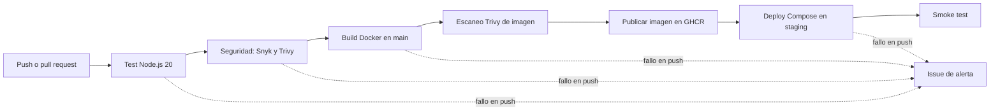

# DevOps 007D OLS

## Descripción del servicio

Microservicio HTTP nativo de Node.js, sin dependencias externas. Expone:

- `GET /`: devuelve un mensaje JSON.
- `GET /health`: devuelve el estado de salud en JSON.
- Otras rutas: responden `404`.

## Pipeline CI/CD

El pipeline está definido en [`.github/workflows/ci-cd.yml`](.github/workflows/ci-cd.yml).



### Jobs

- `test`: se ejecuta en cada push y pull request a `main`; corre los tests con el runner nativo de Node, exige al menos 80% de cobertura de líneas y sube el informe HTML como artefacto.
- `security`: depende de `test`; analiza dependencias y código con Snyk y ejecuta Trivy sobre el filesystem. Detecciones `HIGH`/`CRITICAL` bloquean los jobs siguientes.
- `build-scan-push`: solo en push a `main`; construye la imagen con etiquetas OCI, la escanea con Trivy y la publica en GHCR bajo el SHA corto del commit.
- `deploy`: solo después de publicar la imagen; selecciona el entorno GitHub `staging`, descarga esa misma imagen por SHA, la levanta con Compose y ejecuta un smoke test HTTP.
- `alert`: abre un issue automático en GitHub si falla un job previo en un push.

Los jobs `build-scan-push` y `deploy` solo corren en push a `main`; los jobs `test` y `security` corren para pushes y pull requests a `main`.

## Relación con los 10 pasos del encargo

| Paso | Implementación |
|---|---|
| 01. Dockerfile | [Dockerfile](Dockerfile): build multistage, `node:20-alpine`, `USER node`, `EXPOSE` y `HEALTHCHECK`. |
| 02. Compose | [compose.yaml](compose.yaml) ejecuta `app`, `nginx` y el servicio de prueba por perfil. |
| 03. Variables | `.env` local basado en [.env.example](.env.example); `.env` está excluido en [.gitignore](.gitignore). |
| 04. Healthchecks | Healthchecks HTTP para `app` y `nginx` en [compose.yaml](compose.yaml). |
| 05. Orden | NGINX usa `depends_on` con `condition: service_healthy` para `app`. |
| 06. Documentación | Este README documenta ejecución, pipeline, calidad y trazabilidad. |
| 07. Volúmenes | NGINX monta [nginx.conf](nginx.conf) como solo lectura; las pruebas montan `./reports` al host. |
| 08. Tests | [test/basic.test.js](test/basic.test.js) cubre `/health`, `/` y 404 con `node:test`. |
| 09. Automatización | `npm test`, servicio Compose `tests` bajo perfil `test` y workflow GitHub Actions. |
| 10. Reporte | [scripts/generate-report.js](scripts/generate-report.js) genera `reports/test-report.html`; Actions lo publica como artefacto. |

El contenedor `tests` es un proceso de ejecución única, no un servidor HTTP. Los healthchecks HTTP aplican a los servicios de larga ejecución (`app` y `nginx`).

## Relación con los indicadores del PDF

La pauta denomina los indicadores `IE1`–`IE5`, ponderados en 20% cada uno:

- **IE1 — Contenedores:** imagen Node Alpine, construcción multistage y ejecución como usuario no root.
- **IE2 — Pruebas automatizadas y calidad:** ejecución automática en CI; el umbral de cobertura de líneas de 80% falla el job si no se cumple.
- **IE3 — Seguridad y escalabilidad:** Dependabot para npm, Docker y GitHub Actions; Snyk para dependencias y código; Trivy para filesystem e imagen; Compose con varias réplicas y límites de recursos; los fallos bloquean el pipeline y crean una alerta por issue.
- **IE4 — Despliegue y trazabilidad:** publicación en GHCR etiquetada con SHA corto y labels OCI `revision`/`source`; despliegue de la misma etiqueta en `staging` y smoke test.
- **IE5 — Orquestación:** Docker Compose coordina la aplicación, NGINX como proxy/balanceador y el servicio de pruebas. `APP_REPLICAS` configura las réplicas y el workflow aplica tres en staging.

## Política de calidad y seguridad

- Al menos 80% de cobertura de líneas; pruebas fallidas o cobertura insuficiente fallan `npm test` y el job `test`.
- Snyk aplica el umbral `high` a dependencias y análisis de código.
- Trivy usa `HIGH,CRITICAL` y `exit-code: 1` para filesystem e imagen.
- Los jobs de build y despliegue dependen del job de seguridad exitoso.
- La imagen se construye sin dependencias de runtime externas y corre como usuario no root.
- La etapa runtime elimina npm y npx, que no son necesarios para ejecutar el servicio; npm permanece disponible en la etapa de pruebas.
- Compose limita memoria/CPU, elimina capabilities y activa `no-new-privileges`; los servicios de aplicación y NGINX usan filesystem de solo lectura.

## Trazabilidad

El SHA corto identifica la imagen publicada en GHCR. La imagen incluye los labels OCI `org.opencontainers.image.revision` y `org.opencontainers.image.source`. El job de despliegue descarga esa imagen por la misma etiqueta y registra el despliegue en el Environment `staging`. El reporte de pruebas queda asociado a la ejecución de Actions como artefacto.

## Ejecución local

Requiere Node.js 20 o superior y Docker con Docker Compose.

```bash
# Instalar (sin dependencias de terceros)
npm ci

# Ejecutar pruebas y generar el reporte HTML
npm test

# Configurar variables
cp .env.example .env

# Construir la imagen
docker build -t devops-007d-ols:latest .

# Levantar app y NGINX; Compose toma el número de réplicas de APP_REPLICAS
docker compose up -d --build

# Smoke test local
curl --fail http://localhost:8080/health

# Ejecutar pruebas dentro del contenedor y escribir el reporte en ./reports
docker compose --profile test run --rm tests
```

En Linux, configura `TEST_UID` y `TEST_GID` en `.env` con los resultados de `id -u` e `id -g` si el proceso de pruebas no tiene permiso para escribir en `./reports`.

## Configuración manual de GitHub

1. Crear el secret de repositorio `SNYK_TOKEN`.
2. Crear el GitHub Environment llamado exactamente `staging`.
3. Proteger la rama `main` y exigir los checks `test` y `security`.
4. Habilitar Dependabot alerts/security updates en la configuración del repositorio. Las actualizaciones están declaradas en [.github/dependabot.yml](.github/dependabot.yml).

## Capturas

- [CAPTURA 1]
- [CAPTURA 2]
- [CAPTURA 3]
- [CAPTURA 4]
- [CAPTURA 5]
- [CAPTURA 6]
- [CAPTURA 7]
- [CAPTURA 8]
- [CAPTURA 9]
- [CAPTURA 10]

## Declaración de uso de IA

Se utilizó GitHub Copilot como apoyo para generar configuración y documentación técnica. El equipo debe revisar y validar los contenidos antes de la entrega.

## Conclusiones
