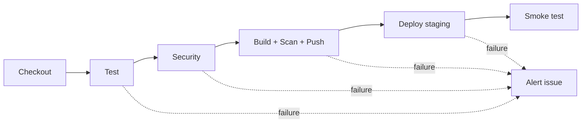

# DevOps 007D OLS

## Descripción del servicio

Este repositorio contiene un microservicio Node.js basado en HTTP nativo, diseñado como una aplicación de demostración para la Evaluación Parcial N°2 de Ingeniería DevOps. El servicio expone dos rutas principales:

- `/` devuelve un mensaje JSON de bienvenida.
- `/health` devuelve `{ "status": "ok" }` para validación de salud y monitoreo.

Su propósito es demostrar una cadena completa de validación, seguridad, entrega de artefactos y despliegue simulado usando GitHub Actions, Docker, Compose y Kubernetes.

## Diagrama del pipeline



## Explicación de cada job y qué indicador cubre

- `test`: se ejecuta en cada push y pull request contra `main`; corre `node:test`, exige cobertura de líneas mínima de 80% y publica el reporte HTML. Cubre IE2 / IL2.2.
- `security`: depende de `test`; ejecuta Snyk para dependencias y código, además de Trivy para el filesystem. Las vulnerabilidades `HIGH` o `CRITICAL` fallan el job y bloquean los siguientes. Cubre IE3 / IL2.3.
- `build-scan-push`: solo en push a `main`, construye la imagen, agrega etiquetas OCI, escanea con Trivy y luego publica en GHCR usando el SHA corto. Cubre IE1 / IL2.1 e IE4 / IL2.4.
- `deploy`: solo en push a `main` y después de la publicación, descarga esa misma imagen etiquetada y la despliega en el entorno GitHub `staging` con Compose; finaliza con un smoke test curl con reintentos. Cubre IE4 / IL2.4 e IE5 / IL2.5.
- `alert`: crea un issue automáticamente cuando falla un job previo. Cubre IE3 / IL2.3.

Este pipeline está definido en un único workflow, [`.github/workflows/ci-cd.yml`](.github/workflows/ci-cd.yml). El workflow antiguo de CI se retiró para evitar ejecuciones redundantes con Node 18 y dejar un único conjunto de checks requerido.

Los indicadores del documento de evaluación se identifican como IL2.1–IL2.5; se relacionan aquí con IE1–IE5 para mantener también la nomenclatura usada en las instrucciones del encargo.

## Relación de los 10 pasos del profesor con los archivos del repo

| Paso | Descripción | Archivo o bloque principal |
|---|---|---|
| 01 | Dockerfile multistage + healthcheck | [Dockerfile](Dockerfile) |
| 02 | Compose con servicios | [compose.yaml](compose.yaml) |
| 03 | Variables de entorno y .env | [.env.example](.env.example) |
| 04 | Healthcheck de servicios | [compose.yaml](compose.yaml) |
| 05 | depends_on con condition service_healthy | [compose.yaml](compose.yaml) |
| 06 | README documentación | [README.md](README.md) |
| 07 | Volúmenes y nginx.conf | [nginx.conf](nginx.conf), [compose.yaml](compose.yaml) |
| 08 | Pruebas con Node test | [test/basic.test.js](test/basic.test.js), [package.json](package.json) |
| 09 | Servicio de pruebas + pipeline | [compose.yaml](compose.yaml), [.github/workflows/ci-cd.yml](.github/workflows/ci-cd.yml) |
| 10 | Reporte HTML y artifact | [scripts/generate-report.js](scripts/generate-report.js), [scripts/run-tests.js](scripts/run-tests.js) |

## Política de calidad

La política de calidad aplicada es:

- Cobertura mínima del 80% de líneas de código.
- El servicio `tests` es de ejecución única, por lo que no tiene healthcheck HTTP; `app` y `nginx` sí tienen healthchecks y NGINX espera a que la app esté saludable.
- El pipeline falla si las pruebas unitarias fallan.
- El pipeline falla si Trivy detecta vulnerabilidades en `HIGH` o `CRITICAL`.
- El pipeline falla si Snyk detecta dependencias con severidad `high` o superior.
- La salida de pruebas se presenta en HTML para revisión y trazabilidad.

## Cómo se garantiza la trazabilidad y la calidad

- Cada commit se relaciona con una imagen GHCR construida a partir del SHA corto del commit; el despliegue de `main` consume esa misma etiqueta.
- La imagen se etiqueta con `org.opencontainers.image.revision` y `org.opencontainers.image.source`.
- El despliegue se ejecuta sobre un entorno `staging` con `environment: staging` en GitHub Actions.
- El artefacto `reports/test-report.html` se sube a GitHub para revisión del comité técnico.
- Los reportes y el entorno simulado permiten correlacionar el cambio, la prueba y el despliegue.

## Cómo ejecutarlo localmente

```bash
# Construir la imagen
docker build -t devops-007d-ols:latest .

# Levantar la aplicación y NGINX
cp .env.example .env
docker compose up -d --build --scale app=3

# Probar la ruta de salud
curl http://localhost:8080/health

# Ejecutar pruebas unitarias dentro del contenedor
docker compose --profile test run --rm tests

# Ejecutar pruebas locales con Node
npm test
```

En Linux, para que el reporte del contenedor quede escribible por el usuario anfitrión, configura `TEST_UID` y `TEST_GID` en `.env` con los valores de `id -u` y `id -g`, respectivamente. En Docker Desktop para Windows o macOS, los valores por defecto del ejemplo suelen ser suficientes.

## Marcadores para capturas

- [CAPTURA 1]
- [CAPTURA 2]
- [CAPTURA 3]
- [CAPTURA 4]
- [CAPTURA 5]
- [CAPTURA 6]

## Manifiestos Kubernetes extra

La carpeta [k8s/](k8s/) contiene un Deployment con probes y límites de recursos, un Service interno y un HorizontalPodAutoscaler configurado por utilización de CPU.

## Declaración de uso de IA

Se utilizó GitHub Copilot como apoyo para generar configuración, automatización y documentación técnica. La propuesta fue revisada y validada por el equipo de trabajo.

## Conclusiones
